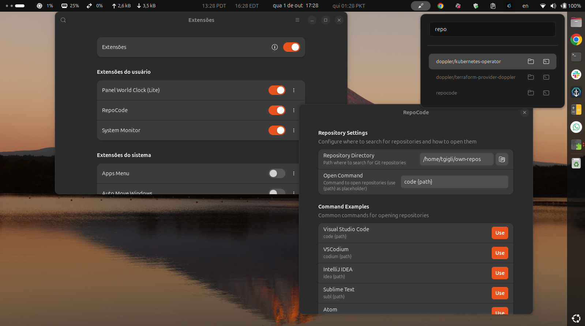

# RepoCode

Quick repository selector with fuzzy search for GNOME Shell.

## Features

- 🔍 **Fuzzy Search** - Find repositories quickly with fzf-style fuzzy matching
- 💻 **Multiple Actions** - Open in editor, terminal, or file manager
- ⚙️ **Configurable** - Set custom repository directory and editor command
- 🎯 **Fast Access** - Access from top bar with a single click

## Usage

Click the extension icon in the top bar to open the repository selector.

For each repository you can:
- **Click the name** - Opens in your configured editor (VSCode, VSCodium, etc.)
- **Click folder icon** - Opens in file manager
- **Click terminal icon** - Opens terminal in repository directory

## Configuration

Access preferences via Extensions app:
- **Repository Directory** - Path where to search for Git repositories
- **Open Command** - Command to open repositories (use `{path}` as placeholder)

## Requirements

- GNOME Shell 45+
- Git repositories to manage

## License

GPL-2.0-or-later
